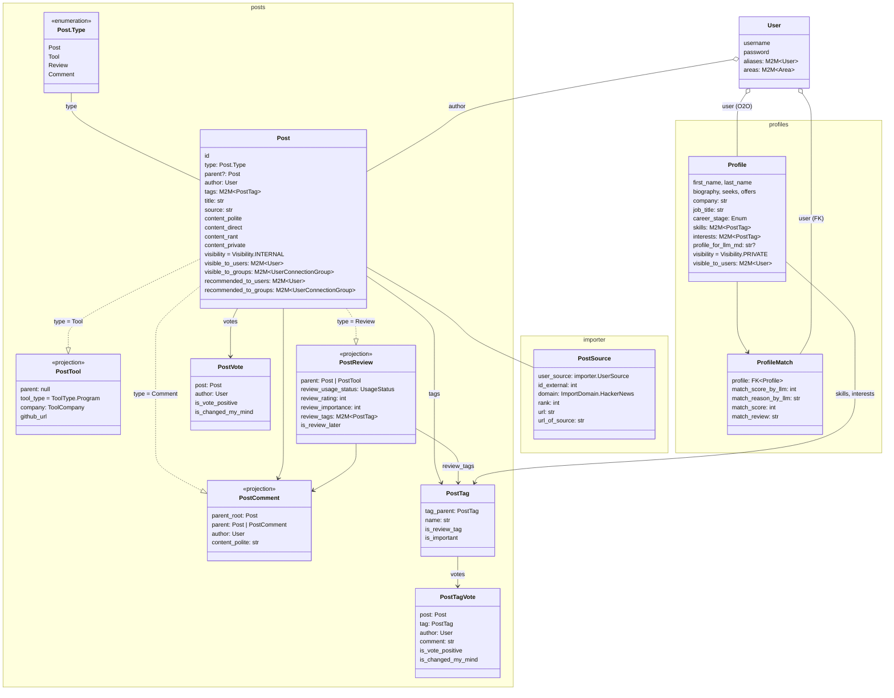

NeuronHub is privacy-first directory for: news, tools, products, profiles, jobs, etc. Users limit the visibility of their `models.Post` (Posts, Reviews, Comments) by selected User groups (akin Google Circles).

<details>
<summary>UML diagram</summary>



</details>

## Tech Stack

- Server: Django v5.2, Strawberry GraphQL, PostgreSQL, pytest, uv, mypy
- Client: React Router v7, @chakra-ui, react-hook-form, Zod, Valtio, Apollo, gql-tada, Bun, Biome
- Search: Algolia
- DevOps: Mise, Docker Compose, GitHub CI

### Documentation

See [docs/architecture/README.md](/docs/architecture/README.md).


Development Setup
--------------------------------

### Linux & Docker

1. Install <a href="https://mise.jdx.dev/getting-started" rel="nofollow">Mise</a>, eg `curl https://mise.run | sh`
2. Install <a href="https://nushell.sh" rel="nofollow">Nushell</a>, eg `brew install nushell`
3. `git clone {url}`
4. `cd neuronhub`
5. ```shell
	mise trust
	mise install
	mise run install-deps
	mise run dev:db:setup # FYI slow due to db_stubs_repopulate 
	mise run dev:db:e2e:setup 
	mise run dev
	```

dev URLs:
- http://localhost:8000/admin
    - login/pass: admin/admin
- http://localhost:3000

The [mise.toml](/mise.toml) has all tasks and scripts.

### Algolia

FE will work only partially without an Algolia app.

- <a href="https://dashboard.algolia.com/users/sign_in" rel="nofollow">Create a free account</a>
- `cp mise.local.toml.example mise.local.toml`
- In this file populate App ID, API key, and Search API key
- `mise run django:algolia-reindex`

### MacOS

To run without Docker, after `git clone`:
- `cp devops/env-examples/mise.macos.toml.example mise.local.toml`

The rest is same as for Linux.

Documentation
--------------------------------

See the [docs/ dir](/docs/).
