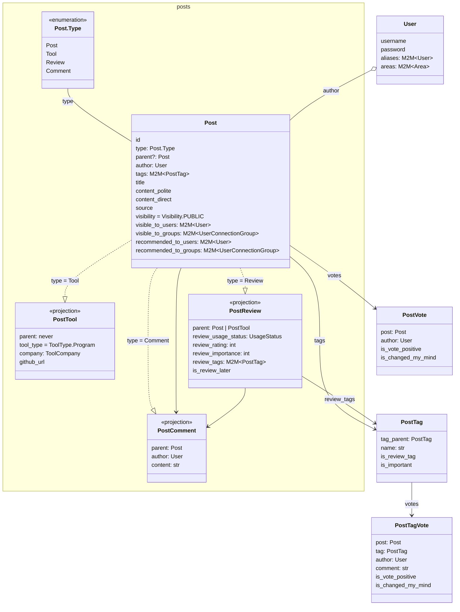

## Architecture

### Overview

Privacy-first sharing of expertise: products, publications, opinions, news, links, etc.
- Users can publish separate versions of their `models.Post` (News, Comments, Reviews, etc) to different User groups (circles).
- Users use `User.aliases` for anonymity, each UserAlias has its own reputation in its Areas: SWE, Physics, Math, Biology, etc.

### Core Models



### Tech Stack

- Server: Django v5.2, Strawberry GraphQL, PostgreSQL, pytest, uv, mypy
- Client: React Router v7, @chakra-ui, react-hook-form, Zod, Valtio, Apollo, gql-tada, Bun, Biome
- DevOps: Mise, Coder, Docker

#### Constraints
- JavaScript ecosystem is bad
- GraphQL cache design isn't feasible
- Django is heavily in tech debt
- React state management became legacy due to the `Proxy` objects
- React Router server API and SSR won't be used

### Project Structure

- `schema.graphql` - the single GraphQL schema
- `docs/`
- `.calude/issues/{doing|closed|not-started}` - project tasks, named as `123-fix-perf-tags-SQL.md`, referenced as `#123` in Git commits.

#### Backend `server/neuronhub`

- `apps/posts/` - core `Post` models and logic
- `apps/tests/` - faker `Gen` factories, db_stubs_repopulate, pytest base class, etc
- `apps/importer/` - importer of Posts from external sources, eg HackerNews

A typical `neuronhub.apps` module structure: `models.py` → `services.py` → `graphql/{types,resolvers,mutations}.py`.

Tags and votes are unified across `Post`'s `<<projection>>`s with models: `PostTag`, `PostVote`, `PostTagVote`. 

```python
class Visibility(models.TextChoices):
    PRIVATE
    USERS_SELECTED
    CONNECTIONS
    SUBSCRIBERS_PAID
    SUBSCRIBERS
    INTERNAL
    PUBLIC
```

#### Frontend `client/`
- `e2e/` - Playwright with its `e2e/tests`
- `src/routes.ts` - has react-router `RouteConfig`, and `export const urls = { ... }` for usage as `urls.reviews.list`.
- `src/apps/` - mirrors `server/neuronhub/apps/`
  - has specialized dirs to match the react-router urls structure, eg has both `/posts` and `reviews/`.
  - react-router v7 `export default` are in empty `index.tsx` files.
  - when a component or hook are used only by one page - it's placed in same dir as react-router `index.tsx`.
- `src/components/` - components shared between `src/apps/`
  - `forms/` - Chakra inputs adapted for react-hook-form.
  - `posts/` - shared code for all `Post` react-hook-forms.
  - `posts/form/*.tsx` - fields for use in `Post` forms.
  - `posts/form/schemas.ts` - all Zod `export namespace schemas` for `Post` react-hook-forms, and serializers + deserializers.
  - `ui/` - deprecated bad "Closed Components" forced by the old @chakra-ui. We're replacing them with `@chakra-ui/react` imports.
  - `layout/` - react-router layouts.
- GraphQL
  - `src/graphql/mutateAndRefetchMountedQueries.ts` - use it instead `client.mutate()`
  - `src/graphql/useApolloQuery.ts` - use instead broken `useQuery`, including its `isLoadingFirstTime` instead of `loading`
  - `src/graphql/client.ts` - Apollo `client`
  - `src/codegen.ts` - is only used for TS enums generation - for GraphQL types we use gql.tada.
- `src/theme/` - @chakra-ui theme config and semantic tokens
- `src/env.ts` - typed `env`
