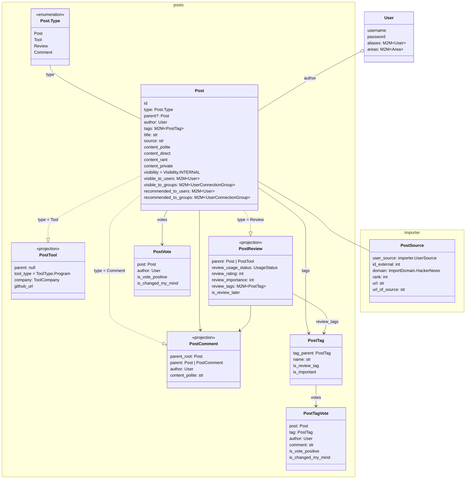

## Tech Stack

- Server: Django v5.2, Strawberry GraphQL, PostgreSQL, pytest, uv, mypy
- Client: React Router v7, @chakra-ui, react-hook-form, Zod, Valtio, Apollo, gql-tada, Bun, Biome
- Search: Algolia
- DevOps: Mise, GitHub CI, Docker

## Overview

NeuronHub is privacy-first platform for sharing expertise: links, opinions, news, tools, products, etc. Users limit the visibility of their `models.Post` (Posts, Reviews, Comments) by selected User groups (akin Google Circles).

## Core Django Models

## Task-specific MUST-read docs

You must read each top-level doc before its children.

- [./backend](./backend/README.md)
- [./frontend](./frontend/README.md)
	- [How to structure a React Component](./frontend/React-component-structure.md)
	- [How to use GraphQL](./frontend/GraphQL.md)
	- [How to use Chakra UI](./frontend/Chakra-UI.md)
- [./tests](./tests.md)
	- [How to use pytest](./backend/pytest.md)
	- [How to use Playwright](./frontend/Playwright.md)
- [Algolia integration](./algolia.md) - used on all FE /posts list pages for its Facets, Pagination, and InstantSearch.
