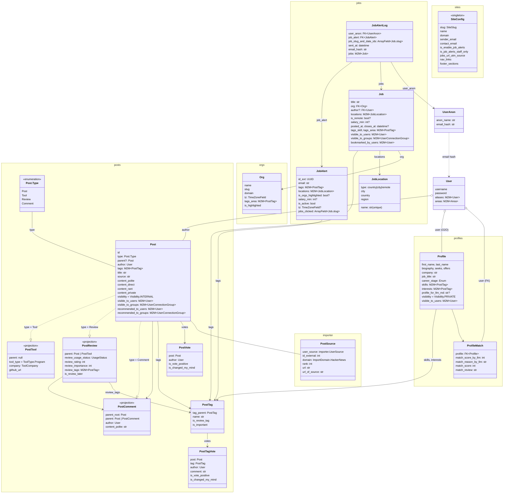

## Tech Stack

- Server: Django v5.2, Strawberry GraphQL, PostgreSQL, pytest, uv, mypy
- Client: React Router v7, @chakra-ui v3, react-hook-form, Zod, Valtio, Apollo, gql-tada, pnpm, oxc
- Search: Algolia
- DevOps: Mise, GitHub CI, Docker, Sentry

## Overview

NeuronHub (NHA, Neuron) is privacy-first directory platform for: news, tools, products, profiles, jobs, etc. Users limit the visibility of their `models.Post` (Posts, Reviews, Comments) by selected User groups (akin Google Circles).

## Core Django Models

## Specific docs

You must read each top-level doc before its children.

- [./backend](./intro/backend/README.mdx)
    - [Profiles app](./intro/backend/profiles.mdx)
- [./frontend](./intro/frontend/README.mdx)
    - [How to structure a React Component](./intro/frontend/React-component-structure.mdx)
    - [How to use GraphQL](./intro/frontend/GraphQL.mdx)
    - [How to use Chakra UI](./intro/frontend/Chakra-UI.mdx)
- [./tests](./intro/tests.mdx)
    - [How to use pytest](./intro/backend/pytest.mdx)
    - [How to use Playwright](./intro/frontend/Playwright.mdx)
- [Algolia integration](./intro/Algolia.mdx) - used on all FE list pages (posts, jobs, profiles) for InstantSearch, Facets, and Pagination.
- [LLM spec logs](/development/reference/llm-spec-logs/) - historical ticket-prompts LLM received and their Git history - ie it's complimentary to the Git log. Named as `{id}-{type}-{name}.mdx` - `#{id}` is from the Git logs.
- [./frontend/docs-site](./intro/frontend/docs-site.mdx) - the `docs/` site (docs.neuronhub.app)
